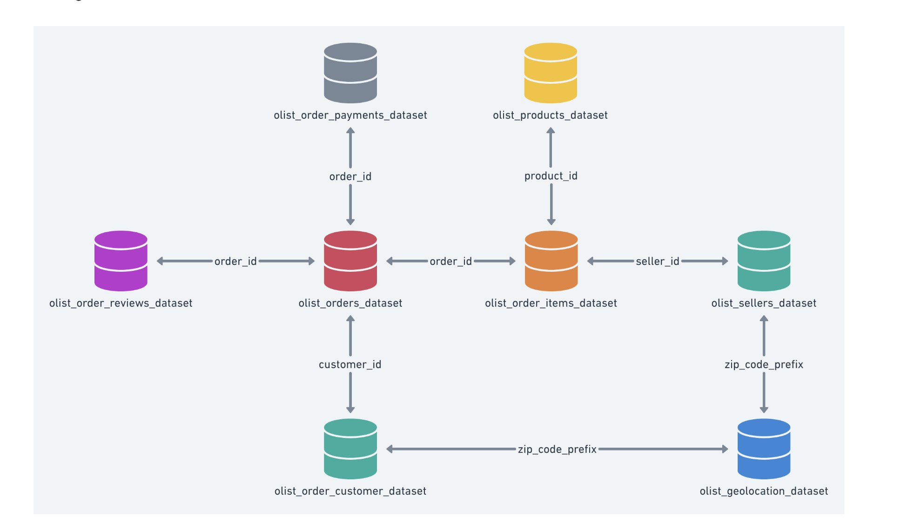
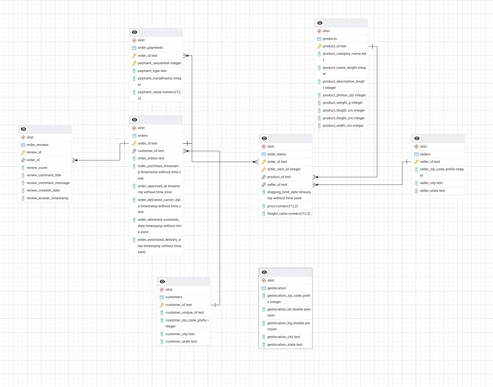

# Olist E‑Commerce Analytics

I’m a data analyst at Olist. This repo builds a PostgreSQL database from the public Olist dataset, validates structures/relations, runs baseline checks, and executes 10+ analytical queries, printing results to the terminal (with optional CSV export).


- `scripts/database_setup.py` — создание БД `olist_analytics` и схемы `olist`.
- `import_olist.py` — полный ресет схемы, загрузка CSV Olist и внешние ключи.
- `database/schema_overview.sql` — быстрый обзор типов колонок.
- `database/relations_check.sql` — проверка связей (anti‑JOIN) и объёмы JOIN.
- `database/checks.sql` — базовые проверки (LIMIT, WHERE/ORDER, GROUP BY, JOIN).
- `database/queries.sql` — 11 аналитических запросов по теме e‑commerce.
- `main.py` — универсальный запускатель SQL‑файлов, печать в терминал и экспорт в CSV.

## ERD screenshots
First (v2) and core flows used in the course deliverable:





## How to run (short)
1) Import and validate DB
```bash
# 1) Create DB and schema (one‑time)
python3 scripts/database_setup.py

# 2) Full reset + load CSVs from ./data (Kaggle Olist)
python3 import_olist.py --host localhost --port 5432 --dbname olist_analytics \
  --user postgres --password postgres --data-dir ./data

# 3) Validate structures and relations
PGPASSWORD=postgres psql -h localhost -p 5432 -U postgres -d olist_analytics -f database/schema_overview.sql
PGPASSWORD=postgres psql -h localhost -p 5432 -U postgres -d olist_analytics -f database/relations_check.sql
```

2) Baseline checks (LIMIT, WHERE/ORDER, GROUP BY, JOIN)
```bash
python3 main.py --dbname olist_analytics --user postgres --password postgres --sql-file database/checks.sql
```

3) 10+ analytics (print results / optional CSV export)
```bash
# print
python3 main.py --dbname olist_analytics --user postgres --password postgres --sql-file database/queries.sql
# export CSVs
python3 main.py --dbname olist_analytics --user postgres --password postgres --sql-file database/queries.sql --save-csv --csv-dir ./out
```

## Tools & data
- PostgreSQL, Python (psycopg2, tabulate)
- Dataset: Brazilian E‑Commerce Public Dataset by Olist (Kaggle)

## GitHub repo
`https://github.com/W0nderful11/olist-ecommerce-analytics.git`
