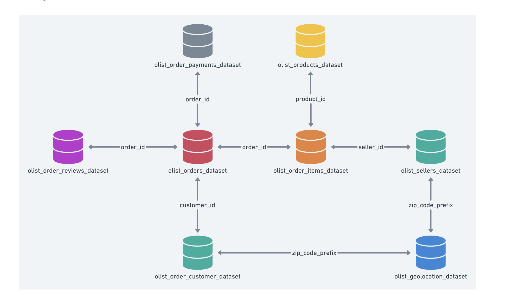
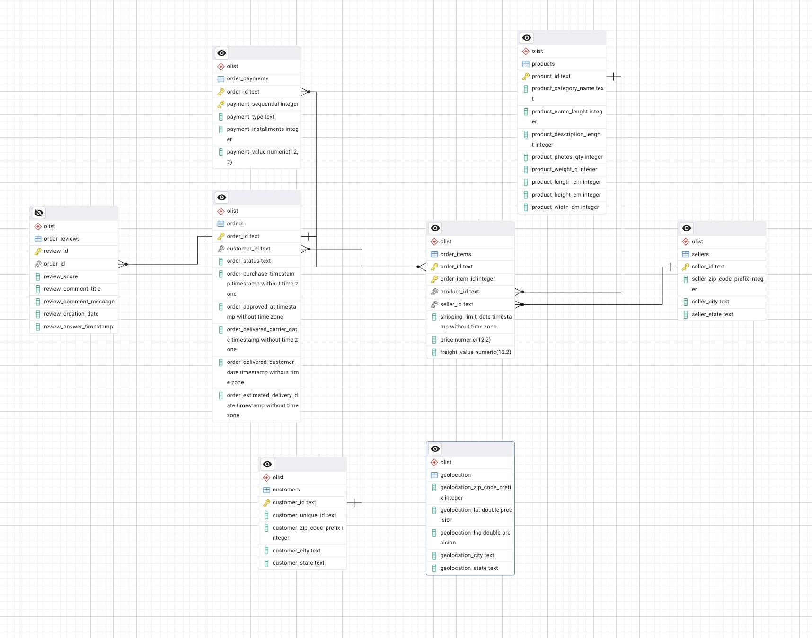
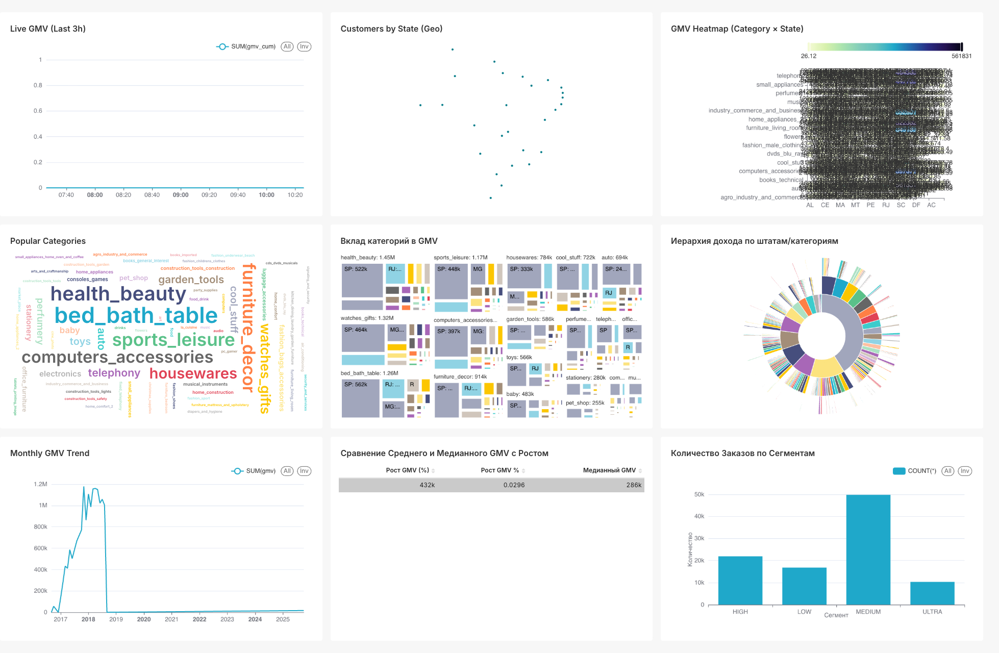
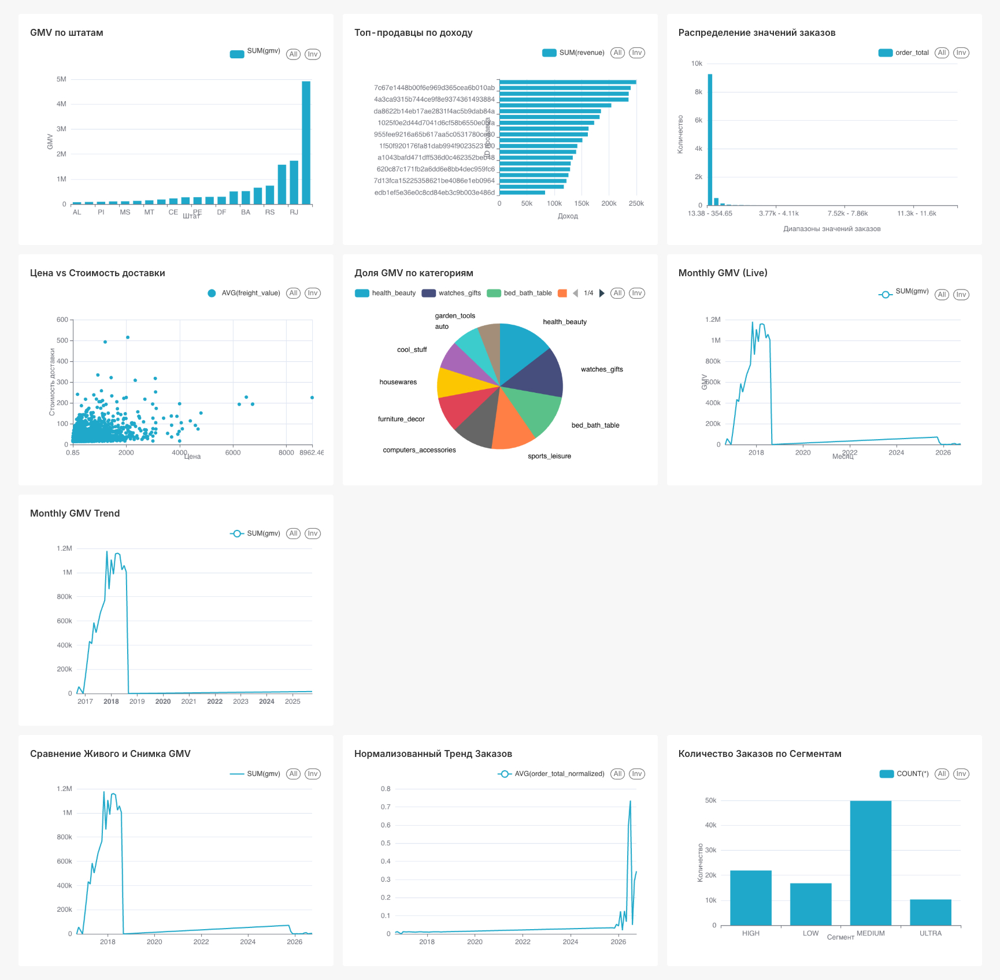

# Olist E‑Commerce Analytics

I’m a data analyst at Olist. This repo builds a PostgreSQL database from the public Olist dataset, validates structures/relations, runs baseline checks, and executes 10+ analytical queries, printing results to the terminal (with optional CSV export).

## Project files 
- `scripts/database_setup.py` — create DB `olist_analytics` and schema `olist`.
- `import_olist.py` — full schema reset, CSV load, and foreign keys.
- `database/schema_overview.sql` — quick column types overview.
- `database/relations_check.sql` — relationship checks (anti‑JOIN) and JOIN volumes.
- `database/checks.sql` — baseline checks (LIMIT, WHERE/ORDER, GROUP BY, JOIN).
- `database/queries.sql` — 11 analytical queries.
- `main.py` — universal SQL runner, prints to terminal and optional CSV export.
- `analytics.py` — 6 charts (2+ JOIN each), Excel export with formatting, Plotly time slider; default run builds all.
- `demo.py` — short SQL‑only demo: insert one order_item for seller 'demo', then delete.
- `charts/` — saved charts (images).
- `exports/` — Excel exports.
- `out/` — Plotly HTMLs and other outputs.

## ERD screenshots
First (v2) and core flows used in the course deliverable:





## How to run (short)
1) Import and validate DB
```bash
# 1) Create DB and schema (one‑time)
python3 scripts/database_setup.py

# 2) Full reset + load CSVs from ./data (Kaggle Olist)
python3 import_olist.py --host localhost --port 5432 --dbname olist_analytics \
  --user postgres --password postgres --data-dir ./data

# 3) Validate structures and relations
PGPASSWORD=postgres psql -h localhost -p 5432 -U postgres -d olist_analytics -f database/schema_overview.sql
PGPASSWORD=postgres psql -h localhost -p 5432 -U postgres -d olist_analytics -f database/relations_check.sql
```

2) Baseline checks (LIMIT, WHERE/ORDER, GROUP BY, JOIN)
```bash
python3 main.py --dbname olist_analytics --user postgres --password postgres --sql-file database/checks.sql
```

3) 10+ analytics
```bash
# print
python3 main.py
```

Install dependencies (once):
```bash
pip install -r requirements.txt
```

All charts are powered by SQL with 2+ JOINs, and the script prints a short report for each: rows count, chart type, and what it shows.

Default run (no flags) now builds everything at once: 6 static charts, Excel export, and opens the interactive time slider.
```bash
python3 analytics.py
```

## Tools & data
- PostgreSQL, Python (psycopg2, tabulate)
- Dataset: Brazilian E‑Commerce Public Dataset by Olist (Kaggle)

## GitHub repo
`https://github.com/W0nderful11/olist-ecommerce-analytics.git`

## Assignment #3 (Apache Superset) Overview

This repository now contains helper scripts and SQL views to accelerate the 15 tasks of Assignment #3 (Midterm). Below is a checklist showing what is already implemented in code and what must be completed manually inside Superset UI.

### Data & Live Inserts
- [x] Base PostgreSQL schema + data import (`scripts/database_setup.py`, `import_olist.py`).
- [x] Live streaming of new facts (Task 2) — `scripts/auto_insert_stream.py` inserts new orders + items + payments every N seconds (FK‑safe, meaningful values). Start it before presenting dashboards:
  ```bash
  python3 scripts/auto_insert_stream.py --interval 8 --batch-size 1
  # or single batch
  python3 scripts/auto_insert_stream.py --once --batch-size 5
  ```

### SQL Views for Superset (Tasks 5–9, 12–14 foundations)
`database/superset_assignment3.sql` creates reusable views:
- `olist.v_geo_customer_state` – centroids for states (Geo Point/Heatmap) (Task 5)
- `olist.v_heatmap_category_state` – category × state GMV matrix (Task 6 Heatmap)
- `olist.v_sunburst_state_category_seller` – hierarchy state → category → seller (Task 7 Sunburst)
- `olist.v_treemap_category_state` – category → state GMV for Treemap (Task 8)
- `olist.v_wordcloud_category_frequency` – frequencies for Word Cloud (Task 9)
- `olist.v_order_totals_enriched` – includes normalized value + segment label (Tasks 13 Normalization, 14 Categorization) — you can also replicate via Calculated Columns UI to demonstrate both approaches.
- `olist.v_monthly_gmv_live` – dynamic monthly GMV (Task 10 live source)
- `olist.v_monthly_gmv_metrics` – provides `gmv` and `prev_gmv` for Growth metrics (Task 12)

Apply them once after data load:
```bash
PGPASSWORD=postgres psql -h localhost -p 5432 -U postgres -d olist_analytics -f database/superset_assignment3.sql
```

### Static Snapshot for Task 10
Create a CSV snapshot to contrast with the live view:
```bash
python3 scripts/export_monthly_gmv_snapshot.py
```
Uploads to `exports/superset/monthly_gmv_snapshot.csv`.
In Superset: Data > Upload CSV (disallowed for raw tables per spec, but allowed here as engineered duplicate for the comparison requirement). Name dataset e.g. `monthly_gmv_snapshot` and build a 2‑line chart (LIVE vs SNAPSHOT). Show divergence as the streaming script keeps inserting new orders.

### Charts Reproduction (Task 4)
Already produced in `analytics.py` (pie, bar, barh, line, histogram, scatter). Rebuild analogs in Superset using base tables or provided views. Ensure axis labels, titles, legends are business‑friendly (no raw IDs without context).

### Geo Visualization (Task 5)
Use `v_geo_customer_state`. Configure point size = customers, tooltip with state code. Optionally switch to Heatmap layer if density visualization is preferred.

### Heatmap (Task 6)
Dataset: `v_heatmap_category_state`. Rows = category, Columns = state, Metric = SUM(gmv) or COUNT(items). Apply top filters if needed.

### Sunburst (Task 7)
Dataset: `v_sunburst_state_category_seller`. Levels: customer_state > category > seller_id. Metric: SUM(revenue).

### Treemap (Task 8)
Dataset: `v_treemap_category_state`. Hierarchy: category > state. Value: SUM(gmv). Color: same metric or distinct dimension.

### Word Cloud (Task 9)
Dataset: `v_wordcloud_category_frequency`. Word: category; Metric: frequency.

### Metrics (Task 12)
In Superset UI (NOT raw SQL):
1. Average: AVG(gmv) (dataset `v_monthly_gmv_live` or `v_monthly_gmv_metrics`).
2. Median: PERCENTILE(gmv, 0.5).
3. Growth %: (gmv - prev_gmv)/prev_gmv from `v_monthly_gmv_metrics` (set prev_gmv as a metric or use custom formula). Display table with both AVG & MEDIAN to compare.

### Calculated Columns & Categorization (Tasks 13, 14)
Demonstrate UI approach although `v_order_totals_enriched` provides examples:
- Normalization formula (0–1): `(order_total - min(order_total)) / (max(order_total) - min(order_total))` using Superset Calculated Column.
- Categorization: CASE or inline conditions to create segments (LOW/MEDIUM/HIGH/ULTRA) if re‑implementing rather than relying on the view.

### Filters, Drill‑Down, Cross‑Filtering (Task 11)
- Add native dashboard filters: Date range (order purchase), Category, State, Seller.
- Enable cross-filtering in charts (checkbox in each chart’s Interaction settings) so selecting a category or state refines others.
- Drill-down: configure hierarchical charts (sunburst/treemap) and enable “drill to detail” (or set extra grouping levels which appear on click).

### Dashboards Design (Task 3)
Suggested thematic dashboards:
1. Customers – geo, heatmap, repeat purchase metrics, order value distribution.
2. Sellers & Products – sunburst, treemap, word cloud, top sellers bar, monthly GMV line (with live vs snapshot).
Ensure consistent color palette, readable labels (rename raw columns like `customer_state` → `Customer State`).

### Dashboard Export (Task 15)
Export JSON/YAML and commit into `superset_exports/` (this folder already exists with a README placeholder).

### Presentation Flow (Suggested)
1. Start live stream: `python3 scripts/auto_insert_stream.py --interval 8`.
2. Open dashboard with auto-refresh (set refresh interval in Superset to 30s or manual refresh demonstration).
3. Show Live vs Snapshot monthly chart diverging.
4. Interact: cross-filter heatmap, treemap, sunburst.
5. Highlight calculated columns & metrics differences (AVG vs Median, normalized value, segments).
6. Mention export JSON location in repo.

### Remaining Manual Steps (Not in code)
- Actual chart creation and styling in Superset (Tasks 3–9, 11–15 visualization layer).
- Creating metrics & calculated columns via Superset UI (Tasks 12–14) — code gives reference but you must create them through the interface for grading criteria.

### Quick Command Summary
```bash
# Create / reset and load data
python3 scripts/database_setup.py
python3 import_olist.py --data-dir ./data

# Create views for Superset
PGPASSWORD=postgres psql -h localhost -p 5432 -U postgres -d olist_analytics -f database/superset_assignment3.sql

# Start live inserts (keep running)
python3 scripts/auto_insert_stream.py --interval 8

# Create static snapshot (run once before or during demo)
python3 scripts/export_monthly_gmv_snapshot.py
```

---
### Dashboard Screenshots

#### Customers Dashboard


#### Sellers & Products Dashboard


All required code-side foundations for Assignment #3 are present. Proceed to build and style the dashboards in Superset and export them into `superset_exports/`.

## Обзор задания №3 (надстройка Apache)

Теперь этот репозиторий содержит вспомогательные скрипты и представления SQL для ускорения выполнения 15 задач задания №3 (промежуточного этапа). Ниже приведен контрольный список, показывающий, что уже реализовано в коде, а что необходимо выполнить вручную в интерфейсе надстройки.

### Данные и оперативные вставки
- [x] Базовая схема PostgreSQL + импорт данных (`scripts/database_setup.py `, `import_olist.py `).
- [x] Прямая трансляция новых фактов (задача 2) — `scripts/auto_insert_stream.py" вставляет новые заказы + товары + платежи каждые N секунд (FK‑безопасные, значимые значения). Запустите его перед отображением информационных панелей:
  ``bash
python3 scripts/auto_insert_stream.py --интервал 8 --размер пакета 1
  # или одиночный пакет
  python3 scripts/auto_insert_stream.py --однократный --размер пакета 5
  ```

### Представления SQL для надмножества (основы заданий 5-9, 12-14)
`database/superset_assignment3.sql` создает повторно используемые представления:
- `olist.v_geo_customer_state` – центроиды для состояний (географическая точка/тепловая карта) (задача 5)
- `olist.v_heatmap_category_state` – матрица GMV категории × состояния (Тепловая карта задачи 6)
- `olist.v_sunburst_state_category_seller` – состояние иерархии → категория → продавец (задача 7 Sunburst)
- `olist.v_treemap_category_state` – категория → GMV состояния для древовидной карты (задача 8)
- `olist.v_wordcloud_category_frequency` – частоты для Word Cloud (задание 9)
- `olist.v_order_totals_enriched` – включает нормализованное значение + метку сегмента (задачи 13 Нормализация, 14 Категоризация) — вы также можете воспроизвести с помощью пользовательского интерфейса вычисляемых столбцов, чтобы продемонстрировать оба подхода.
- `olist.v_monthly_gmv_live` – динамический ежемесячный GMV (текущий источник задачи 10)
- `olist.v_monthly_gmv_metrics` – предоставляет `gmv` и `prev_gmv` для показателей роста (задача 12)

Примените их один раз после загрузки данных:
``bash
PGPASSWORD=postgres psql -h localhost -p 5432 -U postgres -d olist_analytics -f база данных/superset_assignment3.sql
```

### Статический снимок для задачи 10
Создайте снимок в формате CSV, чтобы он отличался от изображения в реальном времени:
``bash
python3 scripts/export_monthly_gmv_snapshot.py
```
Загружает в файл `exports/superset/monthly_gmv_snapshot.csv`.
В дополнительном наборе: Данные > Загрузить CSV (запрещено для необработанных таблиц в соответствии со спецификацией, но разрешено здесь как специально созданный дубликат для сравнения). Назовите набор данных, например, "monthly_gmv_snapshot" и постройте двухстрочный график (в режиме реального времени или моментального СНИМКА). Покажите расхождение, поскольку потоковый скрипт продолжает вставлять новые ордера.

### Воспроизведение графиков (задача 4)
Уже созданные в формате "analytics.py` (круг, столбец, вертикаль, линия, гистограмма, разброс). Перестройте аналоги в надмножестве, используя базовые таблицы или предоставленные представления. Убедитесь, что метки, заголовки и условные обозначения осей удобны для бизнеса (никаких необработанных идентификаторов без контекста).

### Геовизуализация (задача 5)
Используйте `v_geo_customer_state`. Настройте размер точки = клиенты, всплывающую подсказку с кодом состояния. При необходимости переключитесь на слой тепловой карты, если предпочтительнее визуализация плотности.

### Тепловая карта (задача 6)
Набор данных: `v_heatmap_category_state`. Строки = категория, столбцы = состояние, Метрика = СУММА(gmv) или КОЛИЧЕСТВО(элементов). При необходимости примените верхние фильтры.

### Sunburst (задача 7)
Набор данных: `v_sunburst_state_category_seller`. Уровни: customer_state > категория > идентификатор продавца_id. Показатель: СУММА(доход).

### Древовидная карта (задача 8)
Набор данных: `v_treemap_category_state`. Иерархия: категория > состояние. Значение: СУММА(gmv). Цвет: тот же показатель или другое измерение.

### Облако слов (задание 9)
Набор данных: `v_wordcloud_category_frequency`. Слово: категория; Метрика: частота.

### Метрики (задача 12)
В пользовательском интерфейсе надмножества (НЕ в исходном SQL):
1. Среднее значение: AVG(gmv) (набор данных `v_monthly_gmv_live` или `v_monthly_gmv_metrics`).
2. Медиана: ПРОЦЕНТИЛЬ(gmv, 0,5).
3. Процент роста: (gmv - prev_gmv)/prev_gmv из `v_monthly_gmv_metrics` (задайте prev_gmv в качестве показателя или используйте пользовательскую формулу). Отобразите таблицу со средним значением и медианой для сравнения.

### Вычисляемые столбцы и классификация (задачи 13, 14)
Демонстрируем подход к пользовательскому интерфейсу, хотя в "v_order_totals_enriched" приведены примеры:
- Формула нормализации (0-1): `(order_total - минимальный(order_total)) / (max(order_total) - минимальный(order_total))` с использованием вычисляемого столбца Superset.
- Категоризация: ПРЕЦЕДЕНТНЫЕ или встроенные условия для создания сегментов (НИЗКИЙ/СРЕДНИЙ/ ВЫСОКИЙ/УЛЬТРА) при повторной реализации, а не при использовании представления.

### Фильтры, детализация, перекрестная фильтрация (задача 11)
- Добавьте собственные фильтры панели мониторинга: Диапазон дат (заказ покупки), категория, состояние, продавец.
- Включите перекрестную фильтрацию в диаграммах (установите флажок в настройках взаимодействия с каждой диаграммой), чтобы при выборе категории или состояния другие диаграммы были более точными.
- Детализация: настройте иерархические диаграммы (sunburst/treemap) и включите “детализацию до деталей” (или установите дополнительные уровни группировки, которые отображаются при нажатии).

### Разработка информационных панелей (задача 3)
Предлагаемые тематические информационные панели:
1. Клиенты – гео, тепловая карта, показатели повторных покупок, распределение стоимости заказа.
2. Продавцы и продукты – sunburst, древовидная карта, облако word, панель лучших продавцов, ежемесячная линейка GMV (со снимками в реальном времени).
Обеспечьте согласованную цветовую палитру и удобочитаемые надписи (переименуйте исходные столбцы, например, "customer_state" → "Состояние клиента").

### Экспорт панели мониторинга (задача 15)
Экспортируйте JSON/YAML и зафиксируйте в "superset_exports/" (эта папка уже существует с заполнителем README).

### Порядок представления (рекомендуется)
1. Запустите прямую трансляцию: `python3 scripts/auto_insert_stream.py --интервал 8`.
2. Откройте панель мониторинга с автоматическим обновлением (установите интервал обновления в дополнительном наборе равным 30 секундам или выполните демонстрацию обновления вручную).
3. Покажите отклонение месячного графика в реальном времени от моментального снимка.
4. Взаимодействие: тепловая карта с перекрестными фильтрами, древовидная карта, солнечные лучи.
5. Выделите вычисляемые столбцы и различия в показателях (среднее значение по сравнению с медианой, нормализованное значение, сегменты).
6. Укажите местоположение экспорта в формате JSON в репозитории.

### Оставшиеся шаги вручную (не в коде)
- Создание фактической диаграммы и ее стилизация в Superset (задачи 3-9, 11-15 на уровне визуализации).
- Создание показателей и вычисляемых столбцов с помощью пользовательского интерфейса Superset (задачи 12-14) — код содержит ссылки, но вы должны создать их через интерфейс для определения критериев оценки.

### Краткое описание команды
``bash
# Создание / сброс и загрузка данных
python3 scripts/database_setup.py
python3 import_olist.py --data-dir ./data

# Создать представления для надмножества
PGPASSWORD=postgres psql -h localhost -p 5432 -U postgres -d olist_analytics -f база данных/superset_assignment3.sql

# Запустить текущие вставки (продолжить выполнение)
python3 scripts/auto_insert_stream.py --интервал 8

# Создать статический снимок (запустить один раз до или во время демонстрации)
python3 scripts/export_monthly_gmv_snapshot.py
```

---
Все необходимые основы на стороне кода для выполнения задания №3 присутствуют. Приступайте к созданию и стилизации информационных панелей в Superset и экспортируйте их в `superset_exports/`.